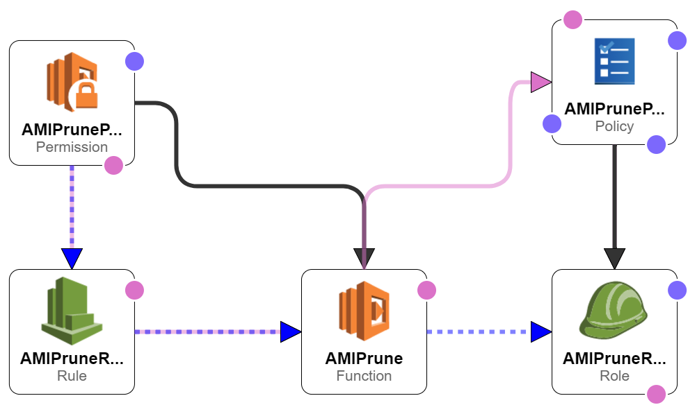

# AMI Prune

## Description
Automatically prune obsolete AMIs created during your build process by deleting any AMI which is older than a set number of days and does not contain a keep tag.

## Environment Variables
| Variable | Description | Default Value |
| -------- | ----------- | ------------- |
| threshold_days | The max number of days before an AMI is pruned | 30 |
| enable_delete | Actually prune the AMIs | false |
| region | The region to perform the pruning in | us-east-1 |
| limit | The maximum number of AMIs which should be deleted (doesn't affect no-op mode) | 400 |

As you can see in the table above, by default this will be in no-op mode, not actually perform the pruning, you must explicitly enable it with the enable_delete for safety while testing.

## Installation
There are two options, you can either simply deploy it using the CloudFormation template in CloudFormation.json or you can do it by hand using the Canary example as a base (will run a lambda function at a specific interval), using the role.json to create a new role and prune.py as the code, filling in the environment variables described above, and setting up the CloudWatch event rule

## Cloud Formation Diagram
