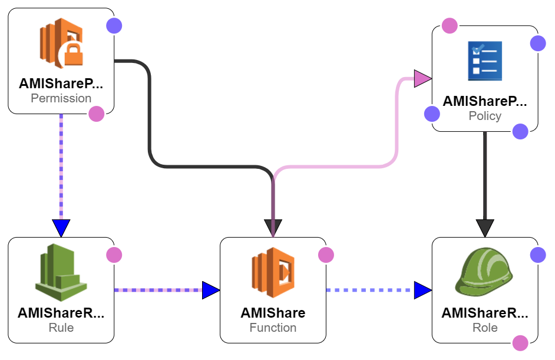

# AMI Share

## Description
Automatically share AMIs with one or more accounts

## Environment Variables
| Variable | Description | Default Value |
| -------- | ----------- | ------------- |
| snap_accounts | A semi-colon seperated list of account numbers to share the snapshot with | aws-marketplace |
| ami_accounts | A semi-colon seperated list of account numbers to share the AMI with | 679593333241 |
| region | The region to perform the share AMIs from | us-east-1 |
| run | Actually share instead of no-op printing what would have been shared | False |

Note the AWS marketplace account is special, it's represented as aws-marketplace on the snapshots but 679593333241 on AMIs.

As you can see in the table above, by default this will be in no-op mode, not actually perform the pruning, you must explicitly enable it with the enable_delete for safety while testing.

## Installation
There are two options, you can either simply deploy it using the CloudFormation template in CloudFormation.json or you can do it by hand using the Canary example as a base (will run a lambda function at a specific interval), using the policy.json to create a new policy and share.py as the code, filling in the environment variables described above, and setting up the CloudWatch event rule.

You will need to modify the CloudFormation.json file to set the S3 bucket to get the zip file with the code and set the accounts you want to share to.  This is set to share unshared AMIs every 5 minutes, with all the defaults set explicitly (including being in no-op mode), so you'll want to make some adjustments to variables in there to fit your needs.

## Cloud Formation Diagram
