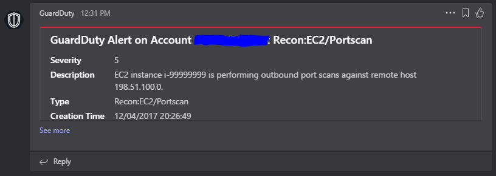
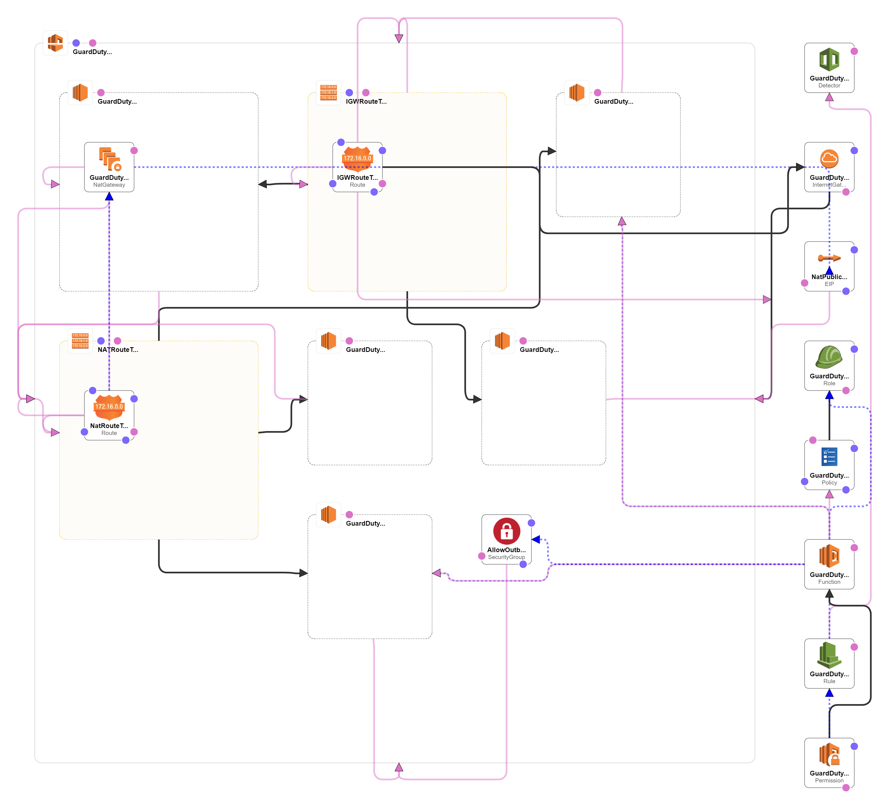

# GuardDuty to Teams

## Description
Automatically send an alert to Microsoft Teams when an alert is created by GuardDuty.

## Environment Variables
| Variable | Description | Default Value |
| -------- | ----------- | ------------- |
| api_url | The URL to send the Teams message to | None |
| severity_threshold | The threshold an event must exceed in order to get sent | 2.0 |

Note that the event severity must be GREATER THAN the severity threshold, so by default this does not alert on "low" severity findings.

## Installation (Microsoft Teams)
In order to get this to work with teams you will need to configure a "connector" on the channel you want the messages to end up in.  In this case you will be doing an "Incoming Webhook" connector where you can give it a name and avatar image, then after you create it, you will get a webhook URL to send the messages to.  Keep this secure as while it doesn't allow reading messages from your chat it would allow nefarious users to spam your chat with whatever they wanted.  This will go into the api_url environment variable for the Lambda function.

## Installation (AWS)
The easiest way to set this up is to zip up the lambda_function.py, throw it in S3 and use the CloudFormation template.  You will just have to fill in the S3 bucket and the URL for your webhook in Microsoft Teams.  Otherwise you can use the CloudFormation template as a guide and do this by hand.

## Sample Alert:

## Cloud Formation Diagram
